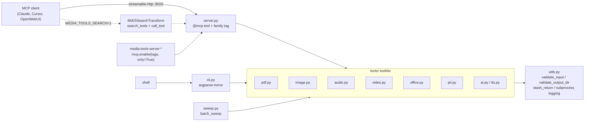
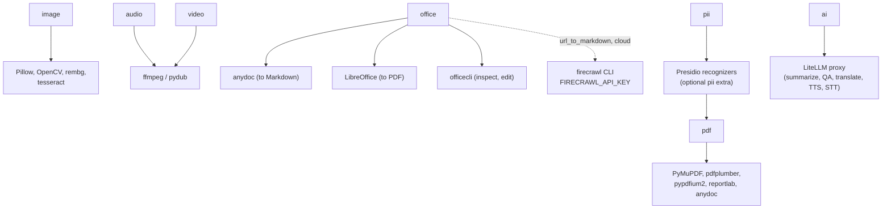

# Architecture

One set of toolkits, three front doors: the MCP server, the scoped servers and the CLI. Tools never call each other over MCP; they call the toolkit classes directly.

## Where work actually happens

## Invariants

- Inputs go through `validate_input`, outputs through `validate_output_dir`; nothing is written in place.
- Tools return strings: a result, JSON, or `Error: ...`. They do not raise to the client.
- Only `url_to_markdown` and the LiteLLM-backed tools leave the machine; everything else is local.
- Scoped servers and `MEDIA_TOOLS_SEARCH=1` change what is listed, not what the tools do.
