<p align="center"></p>

<p align="center">
  An MCP server that lets your AI client work with PDFs, images, audio, video and Office files.<br>
  49 tools, one command to start.
</p>

<p align="center">
  <a href="https://github.com/jrodeiro5/media-tools/actions/workflows/ci.yml"></a>
  <a href="LICENSE"></a>
  
  
</p>

<p align="center">
  <a href="#quick-start">Quick start</a> ·
  <a href="#tools">Tools</a> ·
  <a href="#cli">CLI</a> ·
  <a href="#development">Development</a>
</p>

<p align="center"></p>

---

Ask your assistant to "merge these three PDFs, then compress the result" or "cut 10 seconds from this clip and make a GIF". It calls the matching tools; the files never leave your machine.

Built on [FastMCP](https://github.com/PrefectHQ/fastmcp). Works with any MCP client: Claude Desktop, OpenWebUI, Cursor and others.

## Quick start

```bash
git clone https://github.com/jrodeiro5/media-tools && cd media-tools
uv sync
uv run media-tools-server        # http://localhost:8020/mcp
```

Point your client at it. For a client that reads an `mcpServers` block:

```json
{
  "mcpServers": {
    "media-tools": { "url": "http://localhost:8020/mcp" }
  }
}
```

Set `PORT` to change the port. To expose only one family of tools (and keep the client's context small), run a scoped server: `media-tools-server-pdf`, `-image`, `-audio`, `-video`, `-office`, `-ai` or `-tts`.

## Tools

<table>
<tr><td><b>PDF</b> · 23</td><td>merge, split, compress, rotate, reorder, delete pages, watermark, page numbers, protect, unlock, sign, fill forms, compare, <b>redact</b>, extract text / images / screenshots / structured data, convert to Markdown, DOCX or PDF/A, images to PDF</td></tr>
<tr><td><b>Image</b> · 6</td><td>convert, resize, compress, crop, info, remove background</td></tr>
<tr><td><b>Audio</b> · 5</td><td>convert, trim, fade, speed, info</td></tr>
<tr><td><b>Video</b> · 9</td><td>convert, trim, compress, probe, to GIF, extract audio, extract frames, image to video, audio to video</td></tr>
<tr><td><b>Office</b> · 2</td><td>to Markdown, to PDF (via LibreOffice)</td></tr>
<tr><td><b>AI</b> · 3</td><td>summarize, question answering, translate</td></tr>
<tr><td><b>Speech</b> · 1</td><td>text to speech</td></tr>
</table>

`pdf_redact` renders the matched pages to images and paints over the matches, so the text is gone from the file, not just hidden. Those pages lose their selectable text.

<details>
<summary>Full tool names</summary>

**PDF:** `pdf_merge` `pdf_split` `pdf_compress` `pdf_extract_text` `pdf_extract_images` `pdf_rotate` `pdf_info` `pdf_extract_structured` `pdf_extract_screenshots` `pdf_watermark` `pdf_page_numbers` `pdf_protect` `pdf_unlock` `images_to_pdf` `pdf_reorder_pages` `pdf_delete_pages` `pdf_sign` `pdf_fill_form` `pdf_compare` `pdf_to_a` `pdf_to_markdown` `pdf_to_docx` `pdf_redact`

**Image:** `image_convert` `image_resize` `image_compress` `image_crop` `image_info` `image_remove_background`

**Audio:** `audio_convert` `audio_trim` `audio_fade` `audio_speed` `audio_info`

**Video:** `video_convert` `video_trim` `video_compress` `video_to_gif` `video_probe` `video_extract_audio` `image_to_video` `video_extract_frames` `audio_to_video`

**Office:** `office_to_markdown` `office_to_pdf`

**AI:** `document_summarize` `document_qa` `document_translate`

**Speech:** `text_to_speech`

</details>

## CLI

The same toolkits run without a server:

```bash
media-tools pdf merge a.pdf b.pdf --output merged.pdf
media-tools pdf compress merged.pdf --output small.pdf
media-tools --help
```

The CLI also has a few image commands the server does not expose (rotate, flip, blur, border, merge, OCR).

## Requirements

- Python 3.11 or newer and [uv](https://github.com/astral-sh/uv)
- `ffmpeg` for audio and video, LibreOffice (`soffice`) for Office conversion, `tesseract` for OCR
- Optional: a [LiteLLM](https://github.com/BerriAI/litellm) proxy for the AI tools and text to speech

## Development

```bash
uv sync --group dev
uvx pre-commit run --all-files   # ruff, mypy, bandit, semgrep, gitleaks
```

CI runs the same hooks on Python 3.11 and 3.13, plus CodeQL, gitleaks and zizmor. Found a vulnerability? Use the repository's private vulnerability reporting rather than a public issue.

## License

[MIT](LICENSE). The logo wordmark is outlined from [JetBrains Mono](https://github.com/JetBrains/JetBrainsMono) (SIL OFL 1.1).
