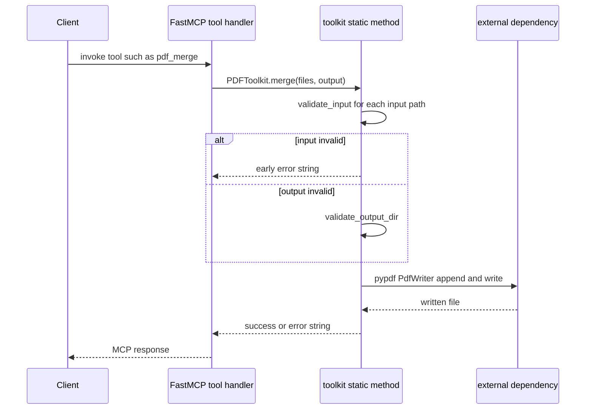

## High-Level Design

media-tools is a **dual-interface** Python package that exposes the same underlying toolkits
through both an MCP server (for AI agents) and a CLI (for scripts/operators). Both entry points
are thin shells that **delegate to the same toolkit static methods**, so a request behaves
identically regardless of interface.

The package ships 49 MCP tools and 29 CLI commands across seven toolkit modules (PDF, image,
audio, video, office, AI, TTS). The toolkit classes themselves hold **no shared mutable state** —
every operation is a `@staticmethod` that takes its inputs, runs the shared validation/logging
pipeline from `utils.py`, and returns a plain result string.

The end-to-end flow is:

```
Client → entry point (FastMCP handler or CLI handler) → toolkit static method
        → utils.validate_input / validate_output_dir gate → external dependency
        → result/error string returned back up the stack
```

## Request Flow

The following sequence shows a representative request (here `pdf_merge`) from client to external
dependency and back. Every other tool follows the same shape: a thin handler delegates to a
toolkit method, the method gates on input/output validation, then performs work via an external
dependency.



## Entry Points

### MCP server (`server.py`)

`server.py` builds a single `FastMCP` instance named "Media Tools" and registers each tool as a
`@mcp.tool` decorator. Each decorator is a **thin wrapper** that carries a `tags={...}` category
value and delegates to the corresponding `ToolkitClass.method()`. On module load it calls
`setup_logging(...)` so the package logger is configured before any request is handled.

The full server (`main`) runs over the `streamable-http` transport on a configurable `PORT`
(default 8020). `stdio` is intentionally not used because it only works for local CLI agents,
whereas `streamable-http` supports browser clients such as OpenWebUI.

```python
mcp = FastMCP("Media Tools", instructions="...")

@mcp.tool(name="pdf_merge", tags={"pdf"})
def pdf_merge(files: list[str], output: str) -> str:
    """Merge multiple PDF files into a single output file."""
    return PDFToolkit.merge(files, output)
```

```python
def main():
    port = int(os.environ.get("PORT", "8020"))
    mcp.run(transport="streamable-http", port=port)
```

### Category-scoped servers (`main_*`)

Nine console scripts are defined in `pyproject.toml`: one CLI dispatcher (`media-tools`), one full
MCP server (`media-tools-server`), and seven **category-scoped** servers (one per toolkit). Each
category script calls `_run_scoped(tag)`, which enables **only** the tools tagged with that
category through `mcp.enable(tags={tag}, only=True)` before starting the server:

```python
def _run_scoped(tag: str):
    mcp.enable(tags={tag}, only=True)
    port = int(os.environ.get("PORT", "8020"))
    mcp.run(transport="streamable-http", port=port)
```

This lets an operator run a lean server exposing a single category (e.g. `media-tools-server-ai`)
instead of all 49 tools, without maintaining separate server code.

### CLI (`cli.py`)

The CLI uses a hand-rolled `argparse` parser with a two-level structure: `category` → `command`.
Handlers are plain functions taking a parsed namespace (`ns`), and the `add()` helper registers
each command with its flags and stores the handler via `set_defaults(handler=handler)`. `main()`
parses arguments, dispatches to `ns.handler(ns)`, and wraps the outcome in JSON via `_result()` /
`_error()` helpers so agents can parse results uniformly.

```python
def main(argv=None) -> int:
    parser = build_parser()
    ns = parser.parse_args(argv)
    try:
        result = ns.handler(ns)
    except Exception as exc:
        print(_error(str(exc)))
        return 1
    print(_result(result))
    return 0
```

**Key design decisions:**
- **No CLI framework**: hand-rolled `argparse` keeps the package dependency-light.
- **JSON output**: all commands return JSON strings for easy parsing by agents.
- **Shared work**: CLI handlers call the exact same `ToolkitClass.method()` that the MCP wrappers
  call, guaranteeing behavioral consistency across interfaces. AI and TTS toolkits are MCP-only
  (no CLI commands).

## Shared Validation & Logging Pipeline (`utils.py`)

`utils.py` is the single shared pipeline every toolkit method runs through before doing work.
Two functions gate **every** toolkit method:

- **`validate_input(path, label)`** — returns an error string (or `None`) after checking that the
  path is non-empty, contains no `..` components (path-traversal block), exists, is a regular file,
  and is readable. URLs (`http://`, `https://`) are allowed through untouched so tools such as
  FireCLI/Firecrawl can accept remote documents.
- **`validate_output_dir(path, label)`** — returns an error string (or `None`) after creating the
  output directory if missing (`mkdir(parents=True)`) and confirming it is writable.

A representative method gates on both at its top, returning the first error string it hits:

```python
def merge(files: list[str], output: str) -> str:
    for f in files:
        err = validate_input(f)
        if err:
            return err
    err = validate_output_dir(output)
    if err:
        return err
    # ... work via pypdf ...
```

`TTS.convert` is the notable exception: because its input is free text rather than a file, it
calls only `validate_output_dir` (plus an empty-text check) and skips `validate_input`.

Two further helpers support the pipeline:

- **`setup_logging(level)`** — configures the `media_tools` logger with timestamped output.
- **`_subprocess_with_logging(cmd, description)`** — runs a subprocess with captured output and
  logging, returning `(result_string, success)`; used by the video and office toolkits that shell
  out to `ffmpeg`/`soffice`.

## External Dependency Entry Points

External dependencies enter **at the toolkit method level**, after validation has passed. Each
toolkit imports or invokes its dependencies where the actual work happens:

| Toolkit | Where the dependency enters | External dependency |
|---------|----------------------------|---------------------|
| `PDFToolkit` | `pdf.py` — `pypdf`/`pdfplumber`/`pypdfium2` for read/write/render; `liteparse` (optional) for structured extraction & screenshots; `reportlab` for watermarks/page numbers/signatures; `pdf2docx` for DOCX; `gs` (Ghostscript, subprocess) for PDF/A; `npx firecrawl` (subprocess) for Markdown | pypdf, pdfplumber, pypdfium2, liteparse, reportlab, pdf2docx, Ghostscript, firecrawl |
| `ImageToolkit` | `image.py` — Pillow for all ops; `pytesseract` (optional) for `ocr`; `rembg` (optional) for background removal | Pillow, pillow-heif, pytesseract, rembg |
| `AudioToolkit` | `audio.py` — `pydub.AudioSegment` (wraps ffmpeg) for convert/trim/fade/speed/merge | pydub, ffmpeg |
| `VideoToolkit` | `video.py` — `ffmpeg`/`ffprobe` (subprocess) for convert/trim/compress/gif/probe/extract; `moviepy` for slideshow/audio_to_video; `cv2` (OpenCV) for extract_frames | ffmpeg, moviepy, opencv-python-headless |
| `OfficeToolkit` | `office.py` — `anydoc` (firecrawl-anydoc) for Markdown; `soffice` (LibreOffice, subprocess) for PDF | anydoc, LibreOffice |
| `AIToolkit` | `ai.py` — `anydoc` to read the document, then an `openai.OpenAI` client pointed at the LiteLLM proxy (`LITELLM_URL`) | anydoc, LiteLLM proxy (Gemma 4) |
| `TTSToolkit` | `tts.py` — a raw HTTP request to the LiteLLM proxy `/v1/audio/speech` (Kokoro); mp3 output converted via pydub/ffmpeg | LiteLLM proxy (Kokoro), pydub |

`liteparse`, `pytesseract`, and `rembg` are optional: their toolkits detect their absence and
return a clear "not installed" error rather than failing at import time (see `HAS_LITEPARSE` in
`pdf.py`).

## Error Propagation Semantics

Toolkit methods are **fail-soft**: instead of raising, each method catches exceptions and returns
a string of the form `"Error: ..."`. Validation failures return early with the error string from
`validate_input`/`validate_output_dir`; runtime failures are caught by a surrounding `try/except`
that formats the exception. Both the MCP server and CLI therefore observe a uniform contract: a
tool call always returns a string, either a success message or an `Error:`-prefixed message. The
CLI additionally re-wraps errors as JSON (`{"error": ...}`) and exits with code 1.

## See Also

- [Operations & Deployment](/openwiki/operations/deployment.md) — server config, dev tooling, CI/CD
