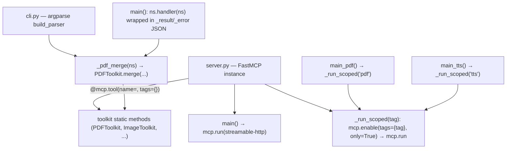

## Two Entry Points, One Set of Toolkits

`media-tools` ships a single set of seven toolkit classes — `PDFToolkit`, `ImageToolkit`,
`AudioToolkit`, `VideoToolkit`, `OfficeToolkit`, `AIToolkit`, and `TTSToolkit` — and exposes them
through **two presentation layers** that delegate to the exact same toolkit static methods:

- **MCP server** (`src/media_tools/server.py`) — a `FastMCP` instance that registers each tool with
  a `@mcp.tool` decorator. The full server exposes all **49 tools**; seven category-scoped entry
  points expose only the tools tagged with one category.
- **CLI** (`src/media_tools/cli.py`) — a hand-rolled `argparse` dispatcher with a two-level
  `category → command` structure and **42 commands** (18 pdf + 12 image + 5 audio + 5 video + 2
  office).

The two files are **not duplicate logic.** `server.py` imports the toolkit classes from
`media_tools.tools` and wraps each method in a `@mcp.tool(name=..., tags={...})` decorator; `cli.py`
imports the same classes and calls the same methods from its command handlers. Both are thin
shells — the toolkits themselves hold no shared mutable state and behave identically regardless of
which entry point invokes them.

```
Client → entry point (FastMCP handler or CLI handler) → ToolkitClass.method()
```

## Console Scripts in pyproject.toml

`[project.scripts]` defines eight console entry points, each mapping a command name to a single
Python callable:

```toml
[project.scripts]
media-tools = "media_tools.cli:main"
media-tools-server = "media_tools.server:main"
media-tools-server-pdf = "media_tools.server:main_pdf"
media-tools-server-image = "media_tools.server:main_image"
media-tools-server-audio = "media_tools.server:main_audio"
media-tools-server-video = "media_tools.server:main_video"
media-tools-server-office = "media_tools.server:main_office"
media-tools-server-ai = "media_tools.server:main_ai"
media-tools-server-tts = "media_tools.server:main_tts"
```

The first two are the CLI dispatcher (`media-tools → cli.main`) and the full MCP server
(`media-tools-server → server.main`). The remaining seven are category-scoped servers: each maps to
one `server.main_*` function (`main_pdf`, `main_image`, … `main_tts`), which in turn calls the shared
`_run_scoped(tag)` helper. Installing the package makes all eight commands available on `PATH` with a
single definition — no per-category server code.

## Server Registration and Scoped Enable

`server.py` builds a single `FastMCP` instance named "Media Tools" and registers each tool with a
`@mcp.tool` decorator that carries a `tags={...}` category value. Every decorator is a thin wrapper
that delegates to the corresponding `ToolkitClass.method()`:

```python
mcp = FastMCP("Media Tools", instructions="...")

@mcp.tool(name="pdf_merge", tags={"pdf"})
def pdf_merge(files: list[str], output: str) -> str:
    """Merge multiple PDF files into a single output file."""
    return PDFToolkit.merge(files, output)
```

At module load, `server.py` calls `setup_logging(os.environ.get("LOG_LEVEL", "INFO"))` so the
`media_tools` logger is configured before any request is handled.

The full server (`main`) runs over the `streamable-http` transport on a configurable `PORT` (default
8020). `stdio` is intentionally not used because it only works for local CLI agents, whereas
`streamable-http` supports browser clients such as OpenWebUI:

```python
def main():
    port = int(os.environ.get("PORT", "8020"))
    mcp.run(transport="streamable-http", port=port)
```

Category-scoped servers are enabled by the shared `_run_scoped(tag)` helper, which calls
`mcp.enable(tags={tag}, only=True)` to expose **only** the tools tagged with that category before
starting the server. This lets an operator run a lean server (e.g. `media-tools-server-ai`) instead
of all 49 tools, without maintaining separate server code:

```python
def _run_scoped(tag: str):
    mcp.enable(tags={tag}, only=True)
    port = int(os.environ.get("PORT", "8020"))
    mcp.run(transport="streamable-http", port=port)


def main_pdf():
    _run_scoped("pdf")
```

## CLI Subcommand → Handler Dispatch

The CLI uses a hand-rolled `argparse` parser with a two-level structure: `category → command`.
Handlers are plain functions taking a parsed namespace (`ns`), and the `add()` helper registers each
command with its flags and stores the handler via `set_defaults(handler=handler)`:

```python
def add(cat_parsers, name, handler, *arg_specs):
    sub = cat_parsers.add_parser(name)
    for flags, kwargs in arg_specs:
        sub.add_argument(*flags, **kwargs)
    sub.set_defaults(handler=handler)
```

`main()` parses arguments, dispatches to the selected handler (`ns.handler(ns)`), and wraps the
outcome in JSON via `_result()` / `_error()` helpers so agents can parse results uniformly:

```python
def main(argv=None) -> int:
    parser = build_parser()
    ns = parser.parse_args(argv)
    try:
        result = ns.handler(ns)
    except Exception as exc:
        print(_error(str(exc)))
        return 1
    print(_result(result))
    return 0
```

Handlers pull their arguments from the parsed namespace and call the same toolkit methods the MCP
wrappers call, guaranteeing behavioral consistency across interfaces. For example:

```python
def _pdf_merge(ns):
    return PDFToolkit.merge(ns.input, ns.output)
```

AI and TTS toolkits are **MCP-only** — they have no CLI commands, so no `image`/`tts` category
appears in the CLI parser.

## How the Two Layers Map

The table below shows how each presentation layer maps to the shared toolkits. The `enable(tags)`
mechanism in the server and the `category → command` structure in the CLI partition the same tools
by category, but both resolve to the identical toolkit static methods.

| Toolkit | MCP tools (server.py) | CLI commands (cli.py) |
|---------|----------------------|-----------------------|
| `PDFToolkit` | 23 tools tagged `pdf` | 18 commands under `pdf` |
| `ImageToolkit` | 7 tools tagged `image` | 12 commands under `image` |
| `AudioToolkit` | 6 tools tagged `audio` | 5 commands under `audio` |
| `VideoToolkit` | 7 tools tagged `video` | 5 commands under `video` |
| `OfficeToolkit` | 2 tools tagged `office` | 2 commands under `office` |
| `AIToolkit` | 3 tools tagged `ai` | — (MCP only) |
| `TTSToolkit` | 1 tool tagged `tts` | — (MCP only) |

## Server Registration → Scoped Enable and CLI Dispatch

The diagram below traces how a tool is registered once, then either exposed to all clients (full
server), restricted to one category (scoped server via `mcp.enable(tags)`), or invoked from the CLI
(argparse dispatch). All three paths converge on the same toolkit static method.



The server instance registers every tool once via its `@mcp.tool` decorator; the full `main()` and
each category-scoped `main_*` (through `_run_scoped`) control *which* tools are exposed, while the
CLI parser maps each `category → command` to the identical toolkit method.

## See Also

- [Architecture Overview](/openwiki/architecture/overview.md) — end-to-end request flow and the
  shared `utils.py` validation/logging pipeline.
- [Quickstart](/openwiki/quickstart.md) — installing the package and running the server or CLI.
